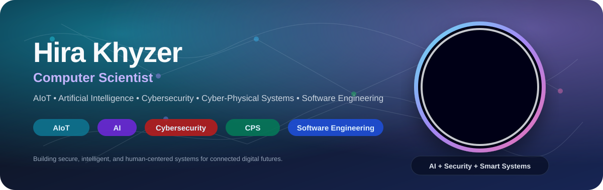
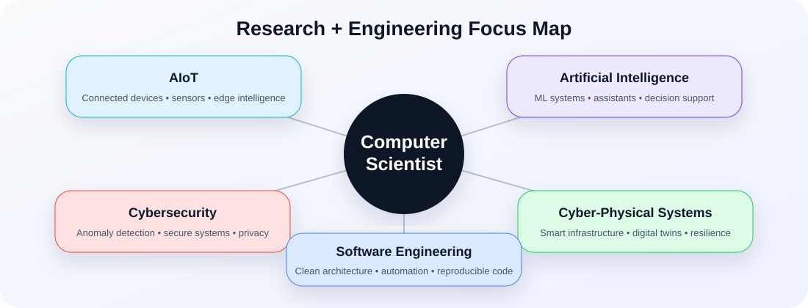
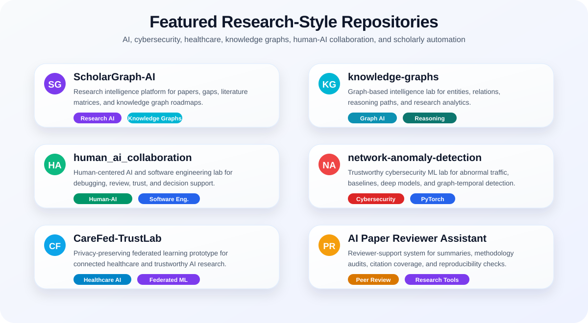
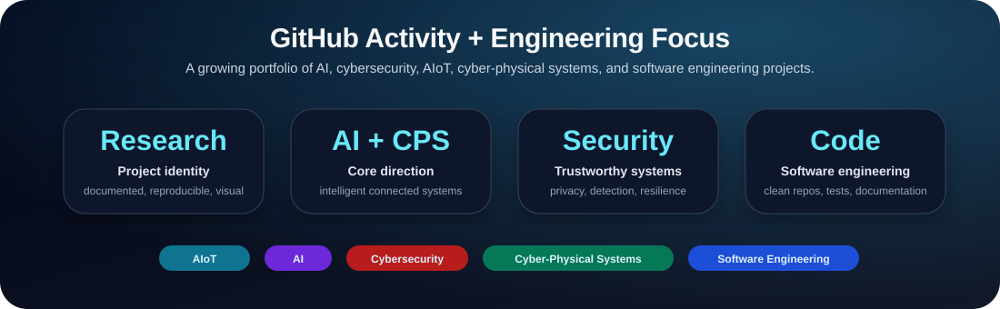

<p align="center">
  
</p>

<h1 align="center">Hi, I'm Hira Khyzer 👋</h1>

<p align="center">
  <b>Computer Scientist focused on AIoT, Artificial Intelligence, Cybersecurity, Cyber-Physical Systems, and Software Engineering.</b>
</p>

<p align="center">
  
  
  
  
</p>

---

## About me

I build intelligent, secure, and human-centered computing systems. My work connects **AI**, **software engineering**, **cybersecurity**, **AIoT**, and **cyber-physical systems** to design research prototypes, automation tools, decision-support platforms, and trustworthy digital infrastructure.

I enjoy turning complex ideas into clean systems, beautiful repositories, reproducible experiments, and practical tools that are easy to understand and extend.

<p align="center">
  
</p>

---

## Core interests

| Area | What I focus on |
|---|---|
| **Artificial Intelligence** | intelligent assistants, decision support, research automation, applied ML |
| **AIoT** | connected devices, sensor intelligence, smart environments, edge-AI workflows |
| **Cybersecurity** | anomaly detection, secure systems, vulnerability analysis, privacy-aware design |
| **Cyber-Physical Systems** | intelligent infrastructure, smart cities, digital twins, resilient systems |
| **Software Engineering** | clean architecture, automation platforms, developer tools, reproducible research code |

---

## Featured research-style repositories

<p align="center">
  
</p>

<p align="center">
  <a href="https://github.com/Hirakhyzer/ScholarGraph-AI"><b>ScholarGraph-AI</b></a> ·
  <a href="https://github.com/Hirakhyzer/knowledge-graphs"><b>knowledge-graphs</b></a> ·
  <a href="https://github.com/Hirakhyzer/human_ai_collaboration"><b>human_ai_collaboration</b></a>
</p>

<p align="center">
  <a href="https://github.com/Hirakhyzer/network-anomaly-detection"><b>network-anomaly-detection</b></a> ·
  <a href="https://github.com/Hirakhyzer/CareFed-TrustLab"><b>CareFed-TrustLab</b></a> ·
  <a href="https://github.com/Hirakhyzer/ai-powered-research-paper-reviewer-assistant"><b>AI Paper Reviewer Assistant</b></a>
</p>

---

## Tech stack

<p align="center">
  
</p>

---

## GitHub activity

<p align="center">
  
</p>

---

## Current direction

```text
Designing intelligent systems that combine research quality, secure engineering,
beautiful documentation, and practical software implementation.
```

---

<p align="center">
  <b>AIoT • AI • Cybersecurity • Cyber-Physical Systems • Software Engineering</b>
</p>
